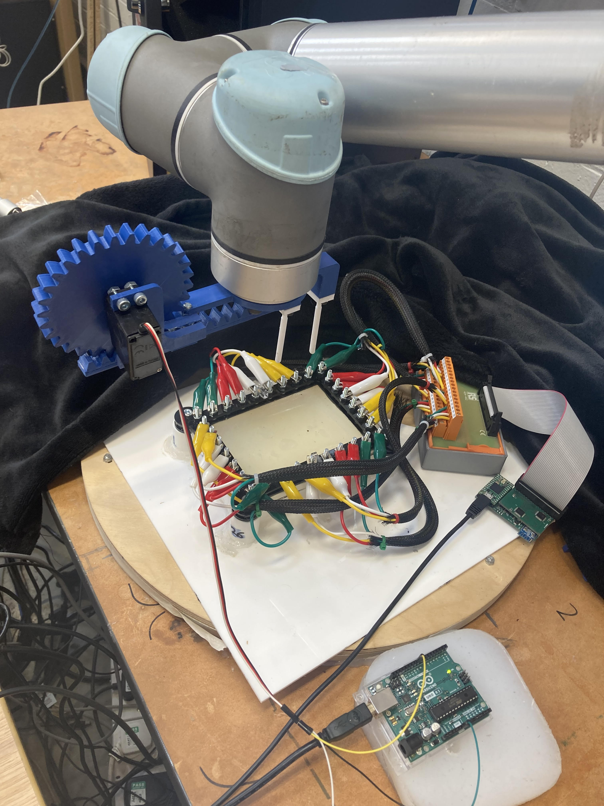

# EIT Touch Sensor

This is my UROP (Undergrad Research) project in the Bio-Inspired Robotics Lab (Cambridge).

I investigate the use of EIT (electrical impedance tomography) as a method of determining touch inputs on robot skins (e-skins). Link to paper [here](https://www.overleaf.com/project/64b908872e5cbb32dc75dfa5). I focus on multi-touch applications in non-circular geometries, for which the traditional inverse-EIT algorithms are less accurate, and instead use a machine learning approach.

## End-goal

To develop a robot e-skin which can be pressed with up to six fingers and determine the location(s) at which it was pressed without using any sensors within the skin.

### Initial Setup

A sensorised gelatin hydrogel is made and cast into a laser-cut rectangular frame. Electrodes are in contact with the skin and connected to a microcontroller (ATtiny AVR) which can measure impedances at high frequency.

A set of plastic fingers are 3D printed and connected to an Arduino-powered servo motor via two gear and track pairs for relative transverse and vertical motion. This setup is attached to a robot (Universal Robots, 5 kg max payload).

The robot and microcontrollers are programmed (Python, C++) to press the skin at a large number of random locations using two fingers at random separation distances and orientations. The EIT experiment is performed during each press down. The UR5 robot is a linkage of several rigid arms which allows for several degrees of freedom. The robot uses its own coordinate system relative to itself as follows:

The EIT readings (voltages relative to untouched baseline) and true positions (encoded as a binary displacement map) are used as the $(\bold{X}, \bold{y})$ datasets to train a series of machine learning algorithms: regression and neural networks.

Once an optimally trained model is found, when the skin receives a new press, it will perform the EIT experiment, use the model to predict the position, and show the position on the computer screen.

An initial idea was to use COMSOL to simulate the EIT process to gather the training data automatically, however the interplay between stress, conductivity and displacement for these soft composite materials was deemed too complex to be reliable, so the real robot was used instead.

As a demonstration, Braille (how blind people read) can be pressed into the skin to find the positions of the dots, and then passed into another algorithm to identify the letter it represents, allowing the skin to read Braille.
